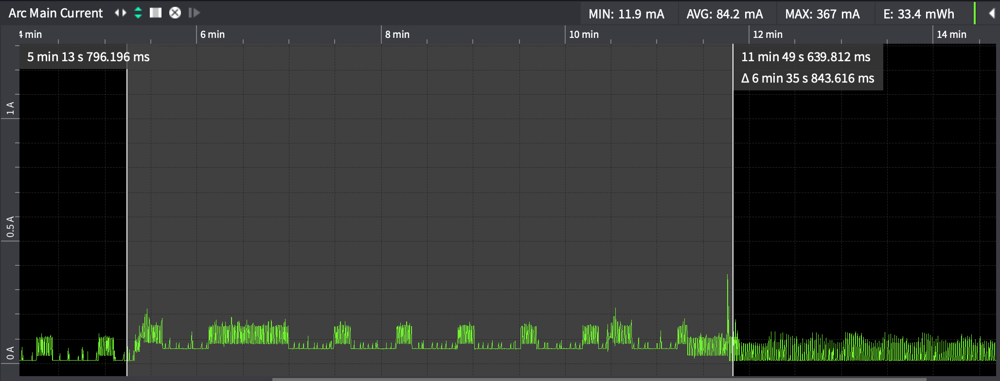
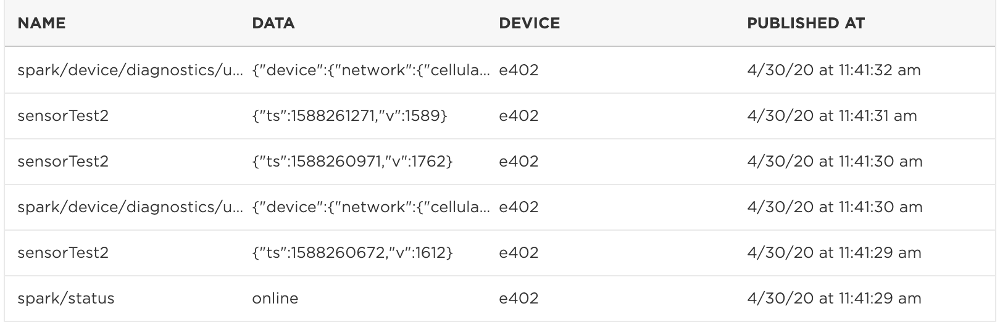

# EEPROM Samples

This example illustrates several useful techniques:

- 5 minute sleep, use stop mode sleep with network standby (`SLEEP_NETWORK_STANDBY`)
- This example is best with short sleep times, under 15 minutes or if you want to be able to publish very quickly after waking up.
- Customizable sending of device diagnostics.
- Customizable software update behavior.
- Stores samples in EEPROM so they are preserved even if the connection fails.
- Periodic sampling with minimal drift, even with connection failures.

The main difference from **Stop-Sleep-Cellular** is that it shows how to store data in EEPROM so they won't be lost when unable to connect. It also shows how to take samples, even if the device is having trouble connecting to cellular, and also do so without drifting so samples are taken at specific intervals.

In terms of power usage it's nearly identical to the **Stop-Sleep-Cellular** example; the graphs and power usage in that example apply here as well.


## Code Walk-Through

Standard stuff used in most of the examples:

```
#include "Particle.h"

// This example uses threading enabled and SEMI_AUTOMATIC mode
#ifndef SYSTEM_VERSION_v620
SYSTEM_THREAD(ENABLED); // System thread defaults to on in 6.2.0 and later and this line is not required
#endif
SYSTEM_MODE(SEMI_AUTOMATIC);
```

If you are testing with a developer device you should leave these lines commented out. But if you are testing product firmware updates, you'll need to uncomment these and set your own product ID and version. The PRODUCT_ID must only be added prior to Device OS 4.0.0; this example will compile correctly targeting all versions of Device OS because of the `#ifndef`.

```
// If you are using a product, uncomment these lines and set the correct product ID and version
// for your product
// #ifndef SYSTEM_VERSION_v400ALPHA1
// PRODUCT_ID(8761);
// #endif
// PRODUCT_VERSION(4);
```

Using Serial1 (RX/TX) for debugging logs and an external TTL serial to USB (FT232) converter
is useful when testing sleep modes. Sleep causes USB serial to disconnect, and you will often
lose the debug logs immediately after wake. With an external USB serial converter, your
serial terminal stays connected so you get all log messages. If you don't have one, you can
comment out the Serial1LogHandler and uncomment the SerialLogHandler to use USB.

```
Serial1LogHandler logHandler(115200);
// SerialLogHandler logHandler;
```

These are our configurable parameters. This example uses [Chrono Literals](https://docs.particle.io/reference/device-os/firmware/#chrono-literals) which is a great feature of Device OS 1.5.0 and later. Instead of setting 6 minutes in milliseconds (360000 or 6 * 60 * 1000), you can just use `6min`. You can also use `30s` for seconds. Or `2h` for hours.

```
// This is the maximum amount of time to wait for the cloud to be connected in
// milliseconds. This should be at least 5 minutes. If you set this limit shorter,
// on Gen 2 devices the modem may not get power cycled which may help with reconnection.
const std::chrono::milliseconds connectMaxTime = 6min;

// This is the minimum amount of time to stay connected to the cloud. You can set this
// to zero and the device will sleep as fast as possible, however you may not get 
// firmware updates and device diagnostics won't go out all of the time. Setting this
// to 10 seconds is typically a good value to use for getting updates.
const std::chrono::milliseconds cloudMinTime = 10s;

// Maximum time to wait for publish to complete. It normally takes 20 seconds for Particle.publish
// to succeed or time out, but if cellular needs to reconnect, it could take longer, typically
// 80 seconds. This timeout should be longer than that and is just a safety net in case something
// goes wrong.
const std::chrono::milliseconds publishMaxTime = 3min;

// Maximum amount of time to wait for a user firmware download in milliseconds
// before giving up and just going back to sleep
const std::chrono::milliseconds firmwareUpdateMaxTime = 5min;

// How often to publish device diagnostics (vitals). If you set this 
// equal to the sleep period they'll be sent on every connection, or you can set
// it higher to save data. For example, if you set it to 24h it would
// only publish once per day. 
const std::chrono::seconds diagnosticPublishTime = 10min;

// How often to check for firmware updates. This requires disconnecting
// from the cloud and reconnecting, so you don't want to do it too often. For 
// non-product firmware you might want to set this to 0 (never check).
const std::chrono::seconds firmwareUpdateCheckTime = 30min;
```

This example does non-drifting sample times. Thus you specify the sample period, not the sleep time. It will adjust the sleep time to account for the differences in connect times, and also continue sampling while trying to reconnect to the cloud!

```
// Period between samples in seconds. This takes into account the amount of time
// to connect and should drift much less than specifying the sleep period.
const std::chrono::seconds sampleTime = 5min;
```

These parameters are specific to the EEEPROM storage system. 

```
// Number of samples to keep. Each sample is 8 bytes.
// 192 = 4 per hour x 24 hours per day x 2 days 
const size_t eepromSampleCount = 192;

// These are bytes to know if the EEPROM has been initialized
const uint32_t eepromDataMagic = 0x797b0d25;

// This is the offset in the EEPROM for our data to start
const int eepromDataOffset = 0;
```

These are the data structures stored in EEPROM.

```
// There is one of these structures for each sample
// Timestamp is the value from Time.now(), Unix time, UTC
// (seconds past January 1, 1970).
// Value is just our ADC test value. You can add more values, but
// you may need to reduce the number of samples saved.
typedef struct { // 8 bytes
    long    timestamp;
    int     value;
} EEPROMSample;

// This is the whole structure saved to EEPROM
typedef struct {    // 1544 bytes
    uint32_t        magic;
    uint16_t        numSamples;  
    uint16_t        reserved;
    size_t          readIndex;
    size_t          writeIndex;
    EEPROMSample    samples[eepromSampleCount];    // 1536 bytes
} EEPROMData;

// We also keep a copy of the EEPROM data cached in RAM. This allows for more
// efficient updates.
EEPROMData eepromCache;
```

Finite state machine state numbers, global variables, and some forward declarations. The forward declarations are necessary in a .cpp file when you reference the function before it's been implemented.

```
// These are the states in the finite state machine, handled in loop()
enum State {
    STATE_WAIT_CONNECTED = 0,
    STATE_WAIT_TIME,
    STATE_PUBLISH,
    STATE_PUBLISH_WAIT,
    STATE_SLEEP,
    STATE_DISCONNECT_WAIT,
    STATE_CONNECT_WAIT,
    STATE_CLOUD_WAIT,
    STATE_FIRMWARE_UPDATE,
};
State state = STATE_WAIT_CONNECTED;
unsigned long stateTime;
bool firmwareUpdateInProgress = false;
long lastFirmwareUpdateCheck = 0;
long lastDiagnosticsPublish = 0;
char publishData[256];
particle::Future<bool> publishFuture;
long nextSampleTime = 0;


void checkSensor(); // forward declaration
void firmwareUpdateHandler(system_event_t event, int param); // forward declaration
```

In order to delay sleep while an firmware upgrade is being downloaded, we use a firmware update handler. This is registered in `setup()`.

```
void setup() {
    System.on(firmware_update, firmwareUpdateHandler);
```

This is where the EEPROM is initialized. The data structure (stored at offset `eepromDataOffset`) begins with magic bytes. If these bytes are not set, then the data structure is assumed to be invalid, such as when the EEPROM is first initialized.

```
    // Read the EEPROM cache data
    EEPROM.get(eepromDataOffset, eepromCache);
    if (eepromCache.magic != eepromDataMagic || eepromCache.numSamples != eepromSampleCount) {
        memset(&eepromCache, 0, sizeof(eepromCache));
        eepromCache.magic = eepromDataMagic;
        eepromCache.numSamples = eepromSampleCount;
        EEPROM.put(eepromDataOffset, eepromCache);
    }
```

We also calculate the next sample time and store it in `nextSampleTime`. It's a Unix time at UTC, as returned from `Time.now()`. The sample period in seconds is in `sampleTime`.

```
    if (eepromCache.writeIndex > 0) {
        nextSampleTime = eepromCache.samples[(eepromCache.writeIndex - 1) % eepromCache.numSamples].timestamp + sampleTime.count();
    }
```

Since we're using `SEMI_AUTOMATIC` mode, it's necessary to connect to cellular and the cloud from `setup()`.

```
    // It's only necessary to turn cellular on and connect to the cloud. Stepping up
    // one layer at a time with Cellular.connect() and wait for Cellular.ready() can
    // be done but there's little advantage to doing so.
    Cellular.on();
    Particle.connect();
    stateTime = millis();
}
```

The `loop()` function implements the finite state machine as a switch statement. But before we handle the states, we call `checkSensor()` to see if it's time the read the sensor and save it in EEPROM. By doing it here, outside of the state machine, we can make sure we get timely samples no matter what state we are in.

```
void loop() {
    // The checkSensor funcvtion checks to see if it's time to check the sensor, and if so reads the 
    // value and saves it to EEPROM. We do this frequently so we don't lose samples because
    // we are trying to reconnect, for example. It's here out of the state machine switch
    // so it happens in every state.
    checkSensor();
```

The first state after `setup()` is `STATE_WAIT_CONNECTED`. This waits until the cloud connects and then goes into `STATE_READ_SENSOR`.

If a timeout occurs, connecting takes longer than `connectMaxTime` then it transitions into `STATE_SLEEP`.

```
    switch(state) {
        case STATE_WAIT_CONNECTED:
            // Wait for the connection to the Particle cloud to complete (at boot)
 
            if (Particle.connected()) {
                Log.info("connected to the cloud in %lu ms", millis() - stateTime);
                state = STATE_WAIT_TIME; 
                stateTime = millis(); 
            }
            else
            if (millis() - stateTime >= connectMaxTime.count()) {
                // Took too long to connect, go to sleep
                Log.info("failed to connect, going to sleep");
                state = STATE_SLEEP;
            }
            break;
```

In this example we do many things based off the real-time-clock and `Time.now()` instead of using `millis()`. Thus after connecting to the cloud, we always wait until we also have a valid time value so we can be sure `Time.now()` can be safely used everywhere.

If the time does not arrive by the `connectMaxTime` it will go into `STATE_SLEEP`. This is unlikely to occur, but it's always good to have a timeout on everything.

```
        case STATE_WAIT_TIME: 
            // In this example, the real time clock is used to add a timestamp to samples and
            // control sleep duration, so we always wait until we have a valid time before
            // we do anything.
            if (Time.isValid()) {
                state = STATE_PUBLISH; 
                stateTime = millis(); 
            }
            else
            if (millis() - stateTime >= connectMaxTime.count()) {
                // Took too long to connect, go to sleep
                Log.info("failed to get time, going to sleep");
                state = STATE_SLEEP;
            }
            break;
```

The `STATE_PUBLISH` state checks to see if there are previously saved entries that have not been sent yet. This can happen if one was just added by `checkSensor()` at the top of `loop()` or because some were left over from a previous connection failure. If there are no samples left, goes into `STATE_SLEEP`.

This is also where we throttle publishing so we don't send them out faster than approximately once per second.

```
        case STATE_PUBLISH:
            if (eepromCache.readIndex < eepromCache.writeIndex) {
                if (Particle.connected()) {
                    if (millis() - stateTime < 1010) {
                        // Throttle publishes to once every 1010 milliseconds (every second, plus a little)
                        break;
                    }
```

In this example, the published data not only includes the value but also a timestamp (`ts`). This is the Unix time at UTC for when the sample was taken. 

```
                    EEPROMSample *sample = &eepromCache.samples[eepromCache.readIndex % eepromCache.numSamples];

                    // Create a simple JSON string with the value of A0
                    snprintf(publishData, sizeof(publishData), "{\"ts\":%ld,\"v\":%d}", sample->timestamp, sample->value);
```

If connected, then the publish is started and runs asynchronously using the `Future`. It goes into `STATE_PUBLISH_WAIT` to wait for the publish to complete.

```
                    // In this example, we use a Future. The publishFuture is a global variable declared:
                    // particle::Future<bool> publishFuture;
                    // The important difference is that even though we use the WITH_ACK flag, this does
                    // not block! We return immediately and can check the result later. This is important
                    // because otherwise the publish can end up blocking longer than our timeout and
                    // we would never go to sleep on failure.
                    publishFuture = Particle.publish("sensorTest2", publishData, PRIVATE | WITH_ACK);

                    state = STATE_PUBLISH_WAIT;
                    stateTime = millis();
                }
                else
                if (millis() - stateTime >= connectMaxTime.count()) {
                    Log.info("failed to connect, going to sleep");
                    state = STATE_SLEEP;
                }
            }
            else {
                // All samples sent
                Log.info("publish complete");
                state = STATE_SLEEP;
            }
            break;
```

The `STATE_PUBLISH_WAIT` state waits for the publish future to resolve. 

If the publish succeeds, it's marked as sent in the EEPROM and then goes back to `STATE_PUBLISH` to see if there are any more samples left to send out.

If an error occurs, just goes into `STATE_SLEEP` to try again later.

```
        case STATE_PUBLISH_WAIT:
            // When checking the future, the isDone() indicates that the future has been resolved, 
            // basically this means that Particle.publish would have returned.
            if (publishFuture.isDone()) {
                // isSucceeded() is whether the publish succeeded or not, which is basically the
                // boolean return value from Particle.publish.
                if (publishFuture.isSucceeded()) {
                    // Successfully sent
                    eepromCache.readIndex++;
                    EEPROM.put(eepromDataOffset + offsetof(EEPROMData, readIndex), eepromCache.readIndex);

                    Log.info("successfully published %s readIndex=%u writeIndex=%u", publishData, eepromCache.readIndex, eepromCache.writeIndex);
                    state = STATE_PUBLISH;
                }
                else {
                    Log.info("publish failed, going to sleep");
                    state = STATE_SLEEP;
                }
            }
            else 
            if (millis() - stateTime >= publishMaxTime.count()) {
                Log.info("failed to publish, timed out");
                state = STATE_SLEEP;
            }
            break;
```

The `STATE_SLEEP` state does some checks before going to sleep. 

The `firmwareUpdateCheckTime` specifies how often to check for firmware updates. This requires disconnecting from the cloud and reconnecting (just the cloud, not cellular) so you probably don't want to do this too often. Maybe every 4 hours or 24 hours would be appropriate. If you set this to 0, no update check will be done. This is a appropriate for developer devices. If it's time to do a firmware update check, then `Particle.disconnect()` is called and it goes into `STATE_DISCONNECT_WAIT` state.

The `diagnosticPublishTime` specifies how often to send device diagnostics. Because this example uses stop mode sleep with network standby, device diagnostics won't be sent automatically except after reset, after firmware update check, or every 3 days. Setting it to 0 disables sending extra diagnostics beyond those.

```
        case STATE_SLEEP:
            if (Particle.connected()) {
                // We can only do these checks if we're connected to the cloud.
                if (lastFirmwareUpdateCheck && firmwareUpdateCheckTime.count() && 
                    Time.now() > (lastFirmwareUpdateCheck + firmwareUpdateCheckTime.count())) {
                    // Do a firmware update check
                    Log.info("starting firmware update check");
                    Particle.disconnect();
                    state = STATE_DISCONNECT_WAIT;
                    break;
                }
                if (lastDiagnosticsPublish && diagnosticPublishTime.count() && 
                    Time.now() > (lastDiagnosticsPublish + diagnosticPublishTime.count())) {
                    Log.info("publishing device vitals");
                    Particle.publishVitals(0);
                    lastDiagnosticsPublish = Time.now();
                }
            }
```

Another difference between this example and **Stop-Sleep-Cellular** is how the sleep time is calculated. By using `nextSampleTime` (real time clock-based) we can keep our sample time from drifting too much.

```
            // We use the real-time clock (Time.now()) to handle sleep time calculations in this
            // example so it doesn't drift because of the time spent connecting and publishing.
            // Time.now() returns seconds past January 1, 1970 (Unix time) UTC, so you don't
            // have to worry about weird things happening during daylight saving transitions.
            {
                long sleepTime = nextSampleTime - Time.now();
                if (sleepTime < 1) {
                    // Can't sleep for less than 1 second
                    state = STATE_PUBLISH;
                    break;
                }

                Log.info("going to sleep for %ld seconds", sleepTime);

                System.sleep(WKP, RISING, sleepTime, SLEEP_NETWORK_STANDBY);         
            }
```

After waking up, go into `STATE_PUBLISH` state.

```
            // Publish after waking up           
            state = STATE_PUBLISH;
            stateTime = millis();
            break; 
```

The `STATE_DISCONNECT_WAIT` state waits for the cloud disconnect to occur. Then it reconnects and goes into `STATE_CONNECT_WAIT` state.

```
        case STATE_DISCONNECT_WAIT:
            // In order to check for a software update we have to disconnect from the Particle
            // cloud, then reconnect. The disconnect is done in STATE_SLEEP if it's time to check
            // for an update. Note that this only disconnects from the cloud, not cellular,
            // so it only takes a few seconds and not much data (just a session resume).
            // 
            // In this state, we wait until disconnected, then reconnect and go into STATE_CONNECT_WAIT.
            if (!Particle.connected()) {
                Log.info("reconnecting to the cloud");
                Particle.connect();
                state = STATE_CONNECT_WAIT;
                stateTime = millis(); 
            }
            break;
```

The `STATE_CONNECT_WAIT` is only used during firmware update check. If the connection succeeds, it goes into `STATE_CONNECT_WAIT` state.

There is also a timeout; if a timeout occurs, for example from bad cellular connectivity, then it goes into `STATE_SLEEP` state and a firmware update check will be done on the next connection.

```
        case STATE_CONNECT_WAIT:
            // Wait for the connection to the Particle cloud to complete
            if (Particle.connected()) {
                Log.info("connected to the cloud in %lu ms, checking for updates", millis() - stateTime);
                state = STATE_CLOUD_WAIT; 
                stateTime = millis(); 

                // Note: Updates both times because connecting to the cloud will also send diagnostic data
                lastFirmwareUpdateCheck = lastDiagnosticsPublish = Time.now();
            }
            else
            if (millis() - stateTime >= connectMaxTime.count()) {
                // Took too long to connect, go to sleep
                Log.info("failed to connect, going to sleep");
                state = STATE_SLEEP;
            }
            break;
```

The `STATE_CLOUD_WAIT` state waits for `cloudMinTime` for the update to start, if one is available. This must be at least 10 seconds.

If an update starts, the `firmwareUpdateHandler()` will set the `firmwareUpdateInProgress` global variable.

```
        case STATE_CLOUD_WAIT:
            // firmwareUpdateInProgress is set from the system event handler function firmwareUpdateHandler.
            // With system thread enabled, updates are downloaded in the background while user firmware
            // continues to run, so we need to make sure we don't go to sleep while downloading.
            if (firmwareUpdateInProgress) {
                Log.info("firmware update detected");
                state = STATE_FIRMWARE_UPDATE;
                stateTime = millis();
            }
            else
            if (millis() - stateTime >= cloudMinTime.count()) {
                Log.info("no update detected, going to sleep");
                state = STATE_SLEEP;
            }
            break;
```

The `STATE_FIRMWARE_UPDATE` state keeps track of when an update starts or times out. If the update completes, the device will reset by itself and start over with calling `setup()`.

```
        case STATE_FIRMWARE_UPDATE:
            // An update is in progress. Stay awake until complete or a timeout occurs.
            if (!firmwareUpdateInProgress) {
                Log.info("firmware update completed");
                state = STATE_SLEEP;
            }
            else
            if (millis() - stateTime >= firmwareUpdateMaxTime.count()) {
                Log.info("firmware update timed out");
                state = STATE_SLEEP;
            }
            break;
    }
```

This bit at the bottom of the loop sets `lastFirmwareUpdateCheck` and `lastDiagnosticsPublish` after the time is available. This makes the updates occur a full interval after a reset, not immediately after reset, when they are not required.

```
    if (lastFirmwareUpdateCheck == 0 && Time.isValid()) {
        lastFirmwareUpdateCheck = Time.now();
    }
    if (lastDiagnosticsPublish == 0 && Time.isValid()) {
        lastDiagnosticsPublish = Time.now();
    }

}
```

This is the `checkSensor()` function. The first thing it does is return quickly if it's not time to sample. Since this function is called on every `loop()` this first test should be efficient.

```
void checkSensor() {
    if (nextSampleTime > Time.now()) {
        // Not time to gather more samples yet
        return;
    }
```

If it's time, calculate the next time.

```
    nextSampleTime += sampleTime.count();
    if (nextSampleTime <= Time.now()) {
        // We must have been turned off for a while. Start the cycles over from the current time.
        nextSampleTime = Time.now() + sampleTime.count();
    }
```

This is just sample code to save the analog value from A0. You'd probably do something more useful here.

```
    // This is just a placeholder for code that you're write for your actual situation
    int a0 = analogRead(A0);
```

Check to see if the EEPROM is full. If there is no more room for more samples, discard the oldest.

```
    // Is there room for another sample?
    if ((eepromCache.writeIndex - eepromCache.readIndex) >= eepromCache.numSamples) {
        // Throw away oldest sample 
        eepromCache.readIndex = eepromCache.writeIndex - eepromCache.numSamples - 1;

        EEPROM.put(eepromDataOffset + offsetof(EEPROMData, readIndex), eepromCache.readIndex);
        Log.info("discarding old sample readIndex=%u writeIndex=%u", eepromCache.readIndex, eepromCache.writeIndex);
    }
```

Then add the new sample.

```
    EEPROMSample *sample = &eepromCache.samples[eepromCache.writeIndex % eepromCache.numSamples];
    sample->timestamp = Time.now();
    sample->value = a0;
    eepromCache.writeIndex++;
    size_t offset = (size_t) ((uint8_t *)sample - (uint8_t *)&eepromCache);
    EEPROM.put(eepromDataOffset + offset, *sample);

    EEPROM.put(eepromDataOffset + offsetof(EEPROMData, writeIndex), eepromCache.writeIndex);
    Log.info("successfully queued readIndex=%u writeIndex=%u", eepromCache.readIndex, eepromCache.writeIndex);
}
```

The firmware update handler sets a global variable when the firmware update starts, so we can defer sleep until it completes (or times out). It may take a little while for the begin handler to be called, 10 seconds is a good minimum value.


```
void firmwareUpdateHandler(system_event_t event, int param) {
    switch(param) {
        case firmware_update_begin:
            firmwareUpdateInProgress = true;
            break;

        case firmware_update_complete:
        case (int)firmware_update_failed:
            firmwareUpdateInProgress = false;
            break;
    }
}
```

## Typical Logs

This is the white then blinking green part:

```
1333 - 0000000083 [comm] INFO: channel inited
6256 - 0000005007 [system] INFO: Sim Ready
6260 - 0000005007 [system] INFO: ARM_WLAN_WD 1
7934 - 0000006685 [system] INFO: ARM_WLAN_WD 2
7938 - 0000006685 [system] INFO: CLR_WLAN_WD 1, DHCP success
```

This is the blinking cyan part:

```
7943 - 0000006687 [system] INFO: Cloud: connecting
7947 - 0000006697 [system] INFO: Read Server Address = type:1,domain:$id.udp.particle.io
7954 - 0000006699 [system] ERROR: Failed to load session data from persistent storage
7961 - 0000006705 [system] INFO: Discarding session data
8356 - 0000007107 [system] INFO: Resolved xxx.udp.particle.io to 100.25.253.74
8434 - 0000007185 [system] INFO: Cloud socket connected
```

Starting the authentication with the cloud:

```
8439 - 0000007187 [system] INFO: Starting handshake: presense_announce=0
8445 - 0000007189 [comm.protocol.handshake] INFO: Establish secure connection
8465 - 0000007215 [comm.dtls] INFO: (CMPL,RENEG,NO_SESS,ERR) restoreStatus=2
```

Connected! Now doing the required startup messages.

```
16934 - 0000015685 [comm.protocol.handshake] INFO: Sending HELLO message
17124 - 0000015876 [comm.protocol.handshake] INFO: Handshake completed
17130 - 0000015880 [system] INFO: Send spark/device/last_reset event
17279 - 0000016031 [system] INFO: Send subscriptions
17349 - 0000016101 [comm.dtls] INFO: session cmd (CLS,DIS,MOV,LOD,SAV): 4
17356 - 0000016101 [comm.dtls] INFO: session cmd (CLS,DIS,MOV,LOD,SAV): 3
17362 - 0000016107 [comm] INFO: Sending TIME request
17432 - 0000016184 [comm.protocol] INFO: message id 2 complete with code 0.00
17439 - 0000016184 [comm.protocol] INFO: rcv'd message type=13
17477 - 0000016229 [comm.protocol] INFO: message id 3 complete with code 0.00
17484 - 0000016229 [comm.protocol] INFO: rcv'd message type=13
17623 - 0000016375 [comm.protocol] INFO: message id 4 complete with code 0.00
17630 - 0000016375 [comm.protocol] INFO: rcv'd message type=13
17768 - 0000016520 [comm.protocol] INFO: message id 5 complete with code 0.00
17775 - 0000016520 [comm.protocol] INFO: rcv'd message type=13
17912 - 0000016664 [comm.protocol] INFO: message id 6 complete with code 0.00
17919 - 0000016664 [comm.protocol] INFO: rcv'd message type=13
18062 - 0000016814 [system] INFO: All handshake messages have been processed
18069 - 0000016814 [comm.protocol] INFO: message id 7 complete with code 2.05
18075 - 0000016820 [comm.protocol] INFO: Received TIME response: 1588257865
18081 - 0000016828 [comm.protocol] INFO: rcv'd message type=12
```

Now `Particle.connected()` returns true. A few more system describe messages are being exchanged, but this happens concurrently with the user code.

```
18190 - 0000016943 [system] INFO: Cloud connected
18195 - 0000016943 [app] INFO: connected to the cloud in 16859 ms
18693 - 0000017444 [comm.protocol] INFO: Posting 'S' describe message
18807 - 0000017559 [comm.dtls] INFO: session cmd (CLS,DIS,MOV,LOD,SAV): 4
18825 - 0000017577 [comm.dtls] INFO: session cmd (CLS,DIS,MOV,LOD,SAV): 3
18832 - 0000017577 [comm.protocol] INFO: rcv'd message type=1
18971 - 0000017723 [comm.protocol] INFO: Posting 'A' describe message
19019 - 0000017771 [comm.dtls] INFO: session cmd (CLS,DIS,MOV,LOD,SAV): 4
19025 - 0000017771 [comm.dtls] INFO: session cmd (CLS,DIS,MOV,LOD,SAV): 3
19031 - 0000017777 [comm.protocol] INFO: rcv'd message type=1
19279 - 0000018031 [comm.protocol] INFO: Posting 'M' describe message
19341 - 0000018093 [comm.protocol] INFO: rcv'd message type=1
19651 - 0000018403 [comm.protocol] INFO: message id 8 complete with code 0.00
19658 - 0000018403 [comm.protocol] INFO: rcv'd message type=13
```

The message has been published and we go to sleep. Note the sleep time is 267 seconds because that's the difference from the last sample that was stored in the EEPROM.

```
19663 - 0000018404 [app] INFO: successfully published {"ts":1588257833,"v":1674} readIndex=3750 writeIndex=3750
19672 - 0000018417 [app] INFO: publish complete
19675 - 0000018421 [app] INFO: going to sleep for 267 seconds
19680 - 0000018426 [comm] INFO: Waiting for Confirmed messages to be sent.
20680 - 0000019433 [comm] INFO: All Confirmed messages sent: client(yes) server(yes)
```

On wake, we queue a new message, send it out, then go back to sleep. This only takes 2.3 seconds!

```
287260 - 0000019637 [app] INFO: successfully queued readIndex=3750 writeIndex=3751
287298 - 0000019676 [comm.protocol] INFO: Posting 'A' describe message
287333 - 0000019711 [comm.dtls] INFO: session cmd (CLS,DIS,MOV,LOD,SAV): 4
287340 - 0000019711 [comm.dtls] INFO: session cmd (CLS,DIS,MOV,LOD,SAV): 3
287346 - 0000019717 [comm.protocol] INFO: rcv'd message type=1
287834 - 0000020212 [comm.protocol] INFO: message id 9 complete with code 0.00
287841 - 0000020212 [comm.protocol] INFO: rcv'd message type=13
288580 - 0000020958 [comm.protocol] INFO: message id 10 complete with code 0.00
288587 - 0000020959 [app] INFO: successfully published {"ts":1588258134,"v":1595} readIndex=3751 writeIndex=3751
288596 - 0000020968 [app] INFO: publish complete
288600 - 0000020971 [app] INFO: going to sleep for 298 seconds
288605 - 0000020958 [comm.protocol] INFO: rcv'd message type=13
288610 - 0000020981 [comm] INFO: Waiting for Confirmed messages to be sent.
289610 - 0000021988 [comm] INFO: All Confirmed messages sent: client(yes) server(yes)
```

This is a log from where device vitals are send in addition to the publish payload.

```          
887238 - 0000024826 [app] INFO: successfully queued readIndex=3752 writeIndex=3753
887388 - 0000024976 [comm.protocol] INFO: message id 13 complete with code 0.00
887395 - 0000024976 [comm.protocol] INFO: rcv'd message type=13
888560 - 0000026148 [comm.protocol] INFO: message id 14 complete with code 0.00
888567 - 0000026149 [app] INFO: successfully published {"ts":1588258734,"v":1607} readIndex=3753 writeIndex=3753
888576 - 0000026158 [app] INFO: publish complete
888580 - 0000026161 [app] INFO: publishing device vitals
888584 - 0000026150 [comm.protocol] INFO: rcv'd message type=13
888692 - 0000026280 [comm.protocol] INFO: Posting 'M' describe message
888754 - 0000026342 [app] INFO: going to sleep for 298 seconds
888765 - 0000026353 [comm] INFO: Waiting for Confirmed messages to be sent.
888968 - 0000026556 [comm.protocol] INFO: message id 15 complete with code 0.00
888975 - 0000026556 [comm.protocol] INFO: rcv'd message type=13
889775 - 0000027364 [comm] INFO: All Confirmed messages sent: client(yes) server(yes)
```


### With Connection Failure

The first part is a normal connection:

```
6567 - 0000005001 [system] INFO: ARM_WLAN_WD 1
8217 - 0000006656 [system] INFO: ARM_WLAN_WD 2
8221 - 0000006656 [system] INFO: CLR_WLAN_WD 1, DHCP success
8226 - 0000006658 [system] INFO: Cloud: connecting
8230 - 0000006668 [system] INFO: Read Server Address = type:1,domain:$id.udp.particle.io
8237 - 0000006670 [system] ERROR: Failed to load session data from persistent storage
8244 - 0000006676 [system] INFO: Discarding session data
8637 - 0000007076 [system] INFO: Resolved xxx.udp.particle.io to 100.25.253.74
8715 - 0000007154 [system] INFO: Cloud socket connected
8720 - 0000007156 [system] INFO: Starting handshake: presense_announce=0
8726 - 0000007158 [comm.protocol.handshake] INFO: Establish secure connection
8745 - 0000007184 [comm.dtls] INFO: (CMPL,RENEG,NO_SESS,ERR) restoreStatus=2
17379 - 0000015819 [comm.protocol.handshake] INFO: Sending HELLO message
17577 - 0000016017 [comm.protocol.handshake] INFO: Handshake completed
17583 - 0000016021 [system] INFO: Send spark/device/last_reset event
17728 - 0000016168 [system] INFO: Send subscriptions
17794 - 0000016234 [comm.dtls] INFO: session cmd (CLS,DIS,MOV,LOD,SAV): 4
17800 - 0000016234 [comm.dtls] INFO: session cmd (CLS,DIS,MOV,LOD,SAV): 3
17806 - 0000016240 [comm] INFO: Sending TIME request
17873 - 0000016313 [comm.protocol] INFO: message id 2 complete with code 0.00
17880 - 0000016313 [comm.protocol] INFO: rcv'd message type=13
17917 - 0000016357 [comm.protocol] INFO: message id 3 complete with code 0.00
17924 - 0000016357 [comm.protocol] INFO: rcv'd message type=13
18063 - 0000016503 [comm.protocol] INFO: message id 4 complete with code 0.00
18070 - 0000016503 [comm.protocol] INFO: rcv'd message type=13
18208 - 0000016648 [comm.protocol] INFO: message id 5 complete with code 0.00
18215 - 0000016648 [comm.protocol] INFO: rcv'd message type=13
18353 - 0000016793 [comm.protocol] INFO: message id 6 complete with code 0.00
18360 - 0000016793 [comm.protocol] INFO: rcv'd message type=13
18503 - 0000016943 [system] INFO: All handshake messages have been processed
18510 - 0000016943 [comm.protocol] INFO: message id 7 complete with code 2.05
18516 - 0000016949 [comm.protocol] INFO: Received TIME response: 1588260371
18522 - 0000016957 [comm.protocol] INFO: rcv'd message type=12
18527 - 0000016958 [app] INFO: successfully queued readIndex=3753 writeIndex=3754
18630 - 0000017071 [system] INFO: Cloud connected
18635 - 0000017071 [app] INFO: connected to the cloud in 16995 ms
19131 - 0000017571 [comm.protocol] INFO: Posting 'S' describe message
19246 - 0000017686 [comm.dtls] INFO: session cmd (CLS,DIS,MOV,LOD,SAV): 4
19264 - 0000017704 [comm.dtls] INFO: session cmd (CLS,DIS,MOV,LOD,SAV): 3
19271 - 0000017704 [comm.protocol] INFO: rcv'd message type=1
19410 - 0000017850 [comm.protocol] INFO: Posting 'A' describe message
19457 - 0000017897 [comm.dtls] INFO: session cmd (CLS,DIS,MOV,LOD,SAV): 4
19463 - 0000017897 [comm.dtls] INFO: session cmd (CLS,DIS,MOV,LOD,SAV): 3
19469 - 0000017903 [comm.protocol] INFO: rcv'd message type=1
19726 - 0000018167 [comm.protocol] INFO: Posting 'M' describe message
19789 - 0000018230 [comm.protocol] INFO: rcv'd message type=1
20101 - 0000018541 [comm.protocol] INFO: message id 8 complete with code 0.00
20108 - 0000018541 [comm.protocol] INFO: rcv'd message type=13
```

And here's the part where the message has been sent and we go to sleep.

```
20113 - 0000018542 [app] INFO: successfully published {"ts":1588260371,"v":1716} readIndex=3754 writeIndex=3754
20122 - 0000018555 [app] INFO: publish complete
20125 - 0000018559 [app] INFO: going to sleep for 299 seconds
20130 - 0000018564 [comm] INFO: Waiting for Confirmed messages to be sent.
21130 - 0000019571 [comm] INFO: All Confirmed messages sent: client(yes) server(yes)
```

While asleep I disconnected the antenna, so when it woke and tried to send, it failed.

```
319505 - 0000019583 [comm.dtls] WARN: mbedtls_ssl_write returned ffffffff
319512 - 0000019583 [comm.protocol] ERROR: Event loop error 3
319517 - 0000019588 [system] WARN: Communication loop error, closing cloud socket
319523 - 0000019594 [system] INFO: Cloud: disconnecting
319527 - 0000019598 [system] INFO: Cloud: disconnected
```

However, while attempting to connect it was still able to queue a sample:

```
319531 - 0000019586 [app] INFO: successfully queued readIndex=3754 writeIndex=3755
319624 - 0000019702 [system] INFO: Cloud: connecting
319645 - 0000019723 [system] INFO: Read Server Address = type:1,domain:$id.udp.particle.io
319654 - 0000019725 [system] ERROR: Failed to load session data from persistent storage
319661 - 0000019733 [system] INFO: Discarding session data
320199 - 0000020277 [system] ERROR: Unable to resolve IP for xxx.udp.particle.io (1)
320208 - 0000020279 [system] ERROR: Failed to determine server address
320214 - 0000020285 [system] WARN: Cloud socket connection failed: -230
320321 - 0000020399 [system] WARN: Internet available, Cloud not reachable!
320328 - 0000020399 [system] WARN: Handling cloud error: 3
321225 - 0000021303 [system] INFO: Cloud: connecting
321230 - 0000021307 [system] INFO: Read Server Address = type:1,domain:$id.udp.particle.io
321237 - 0000021309 [system] ERROR: Failed to load session data from persistent storage
321244 - 0000021317 [system] INFO: Discarding session data
321849 - 0000021927 [system] ERROR: Unable to resolve IP for xxx.udp.particle.io (1)
321858 - 0000021929 [system] ERROR: Failed to determine server address
321864 - 0000021935 [system] WARN: Cloud socket connection failed: -230
321869 - 0000021941 [system] WARN: Resetting WLAN due to 2 failed connect attempts
321978 - 0000022056 [system] WARN: Internet available, Cloud not reachable!
321985 - 0000022056 [system] WARN: Handling cloud error: 3
322082 - 0000022160 [system] WARN: Resetting WLAN due to SPARK_WLAN_RESET
322088 - 0000022160 [system] INFO: Clearing WLAN WD in disconnect()
322107 - 0000022185 [system] INFO: Clearing WLAN WD in disconnect()
327210 - 0000027289 [system] INFO: Sim Ready
327215 - 0000027289 [system] INFO: ARM_WLAN_WD 1
```

And another one here. Then it finally gives up and goes to sleep.

```
618468 - 0000318578 [app] INFO: successfully queued readIndex=3754 writeIndex=3756
627562 - 0000327674 [system] WARN: Resetting WLAN due to WLAN_WD_TO()
627568 - 0000327674 [system] INFO: Clearing WLAN WD in disconnect()
627573 - 0000327680 [system] INFO: Clearing WLAN WD in disconnect()
632636 - 0000332748 [system] INFO: Sim Ready
632640 - 0000332748 [system] INFO: ARM_WLAN_WD 1
679466 - 0000379584 [app] INFO: failed to connect, going to sleep
679472 - 0000379584 [app] INFO: going to sleep for 239 seconds
```

Here's the power usage during that connection failure, which took almost 12 minutes.

| Parameter | Value | 
| :--- | ---: | 
| Time | 11:49 | 
| Minimum Current | 11.9 mA|
| Average Current | 84.2 mA | 
| Maximum Current | 367.0 mA | 
| Energy | 33.4 mWh |



As you can see - failing to connect can use a lot of power!

Here I've reattached the antenna and the device has woken from sleep.

```
918448 - 0000379591 [system] WARN: Resetting WLAN due to WLAN_WD_TO()
918454 - 0000379591 [system] INFO: Clearing WLAN WD in disconnect()
918459 - 0000379596 [system] INFO: Clearing WLAN WD in disconnect()
```

A third sample is queued right after waking up, to go with the two that are currently saved in EEEPROM.

```
918464 - 0000379594 [app] INFO: successfully queued readIndex=3754 writeIndex=3757
925086 - 0000386231 [system] INFO: Sim Ready
925090 - 0000386231 [system] INFO: ARM_WLAN_WD 1
925148 - 0000386293 [system] INFO: ARM_WLAN_WD 2
925153 - 0000386293 [system] INFO: CLR_WLAN_WD 1, DHCP success
925158 - 0000386295 [system] INFO: Cloud: connecting
925161 - 0000386305 [system] INFO: Read Server Address = type:1,domain:$id.udp.particle.io
925169 - 0000386307 [system] ERROR: Failed to load session data from persistent storage
925176 - 0000386313 [system] INFO: Discarding session data
925781 - 0000386926 [system] INFO: Resolved xxx.udp.particle.io to 54.89.110.189
925859 - 0000387004 [system] INFO: Cloud socket connected
925865 - 0000387006 [system] INFO: Starting handshake: presense_announce=0
925870 - 0000387008 [comm.protocol.handshake] INFO: Establish secure connection
925891 - 0000387036 [comm.dtls] INFO: (CMPL,RENEG,NO_SESS,ERR) restoreStatus=2
934583 - 0000395728 [comm.protocol.handshake] INFO: Sending HELLO message
934913 - 0000396059 [comm.protocol.handshake] INFO: Handshake completed
935014 - 0000396160 [system] INFO: Send subscriptions
935105 - 0000396251 [comm.dtls] INFO: session cmd (CLS,DIS,MOV,LOD,SAV): 4
935112 - 0000396251 [comm.dtls] INFO: session cmd (CLS,DIS,MOV,LOD,SAV): 3
935118 - 0000396257 [comm] INFO: Sending TIME request
935319 - 0000396465 [comm.protocol] INFO: message id 11 complete with code 0.00
935326 - 0000396465 [comm.protocol] INFO: rcv'd message type=13
935464 - 0000396610 [comm.protocol] INFO: message id 12 complete with code 0.00
935471 - 0000396610 [comm.protocol] INFO: rcv'd message type=13
935609 - 0000396755 [comm.protocol] INFO: message id 13 complete with code 0.00
935616 - 0000396755 [comm.protocol] INFO: rcv'd message type=13
935758 - 0000396904 [comm.protocol] INFO: message id 14 complete with code 0.00
935765 - 0000396904 [comm.protocol] INFO: rcv'd message type=13
935908 - 0000397054 [system] INFO: All handshake messages have been processed
935915 - 0000397054 [comm.protocol] INFO: message id 15 complete with code 2.05
935921 - 0000397062 [comm.protocol] INFO: Received TIME response: 1588261288
935928 - 0000397068 [comm.protocol] INFO: rcv'd message type=12
936037 - 0000397183 [system] INFO: Cloud connected
936358 - 0000397504 [comm.protocol] INFO: message id 16 complete with code 0.00
```

Here's where it starts sending out the queued messages.

```
936365 - 0000397505 [app] INFO: successfully published {"ts":1588260672,"v":1612} readIndex=3755 writeIndex=3757
936374 - 0000397504 [comm.protocol] INFO: rcv'd message type=13
936530 - 0000397675 [comm.protocol] INFO: Posting 'S' describe message
936642 - 0000397788 [comm.dtls] INFO: session cmd (CLS,DIS,MOV,LOD,SAV): 4
936660 - 0000397806 [comm.dtls] INFO: session cmd (CLS,DIS,MOV,LOD,SAV): 3
936667 - 0000397806 [comm.protocol] INFO: rcv'd message type=1
936807 - 0000397953 [comm.protocol] INFO: Posting 'A' describe message
936856 - 0000398002 [comm.dtls] INFO: session cmd (CLS,DIS,MOV,LOD,SAV): 4
936863 - 0000398002 [comm.dtls] INFO: session cmd (CLS,DIS,MOV,LOD,SAV): 3
936868 - 0000398008 [comm.protocol] INFO: rcv'd message type=1
937118 - 0000398264 [comm.protocol] INFO: Posting 'M' describe message
937180 - 0000398326 [comm.protocol] INFO: rcv'd message type=1
937489 - 0000398635 [comm.protocol] INFO: message id 17 complete with code 0.00
937496 - 0000398636 [app] INFO: successfully published {"ts":1588260971,"v":1762} readIndex=3756 writeIndex=3757
937505 - 0000398635 [comm.protocol] INFO: rcv'd message type=13
938660 - 0000399806 [comm.protocol] INFO: message id 18 complete with code 0.00
938667 - 0000399807 [app] INFO: successfully published {"ts":1588261271,"v":1589} readIndex=3757 writeIndex=3757
938676 - 0000399816 [app] INFO: publish complete
938680 - 0000399819 [app] INFO: publishing device vitals
938684 - 0000399806 [comm.protocol] INFO: rcv'd message type=13
938788 - 0000399934 [comm.protocol] INFO: Posting 'M' describe message
938851 - 0000399997 [app] INFO: going to sleep for 281 seconds
938862 - 0000400008 [comm] INFO: Waiting for Confirmed messages to be sent.
939153 - 0000400299 [comm.protocol] INFO: message id 19 complete with code 0.00
939160 - 0000400299 [comm.protocol] INFO: rcv'd message type=13
939872 - 0000401019 [comm] INFO: All Confirmed messages sent: client(yes) server(yes)
```

The timestamps are pretty close, within a second of being exactly 5 minutes.

| Timestamp  | Date |
| :--------- | :--- |
| 1588260672 | Thu, 30 Apr 2020 15:31:12 +0000 |
| 1588260971 | Thu, 30 Apr 2020 15:36:11 +0000 |
| 1588261271 | Thu, 30 Apr 2020 15:41:11 +0000 |

Here's the console event log with the queued events coming in 1 per second after reconnection:


