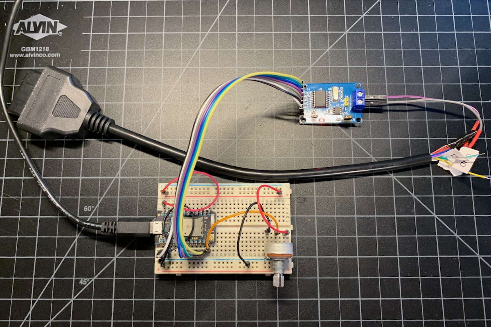
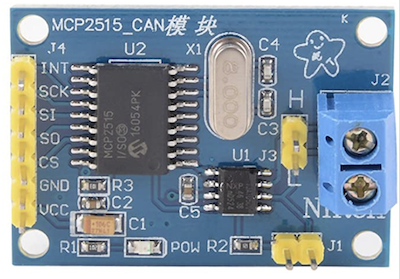

# OBD-II Engine RPM Simulator

To make it easier to test and debug the CAN bus code, you can save some time using this simulator. It's a lot easier than dragging your laptop out to your car!



What you will need:

- A Gen 2 Particle Device (Photon or Electron)

The reason for Gen 2 is that most CAN interface breakouts are 5V. Gen 3 devices (Argon, Boron, B Series SoM, Tracker SoM) only support 3.3V logic. There are some 3.3V CAN breakouts if you want to use a Gen 3 device, but I didn't test that.

- Solderless breadboard
- Potentiometer (at least 50K)
- 120 ohm resistor

Connect the outer pins to 3V3 and GND. Connect the inner (wiper) to A0, the orange wire in the picture above.

- Hookup wires

- [CAN bus interface with MCP2515](https://www.amazon.com/gp/product/B01IV3ZSKO/ref=ppx_yo_dt_b_search_asin_title) ($14.99 for 3).



| Label | Color | Photon |
| :--- | :--- | :--- |
| INT | Yellow |  A1 |
| SCK | Green | A3 (SCK) |
| SI | Blue | A5 (MOSI) |
| SO | Purple | A4 (MISO) |
| CS | Gray | A2 (CS) |
| GND | Black | GND |
| VCC | White | VIN |

Note that the CAN interface is powered by VIN, which is only powered when using USB power. On the Electron, you can't power using LiPo as 5V is required for the CAN interface.

On this board, it's also necessary to put a jumper on J1. That's the CAN termination resistor enable, and there should be a termination resistor on both ends of the CAN bus.

- [Female J1962 cable](https://www.amazon.com/dp/B07F16HC12/ref=nav_timeline_asin?_encoding=UTF8) ($7.99)

| Pin   | Purpose | Color |
| :---: | :--- | :--- |
| 5  | Signal Ground (optional) | Yellow |
| 6  | CANH | Green |
| 14 | CANL | Brown/White |  

Note that CAN bus is differential and consists of two lines:

- CANH (high), CAN_P (positive), or CAN+
- CANL (low), CAN_N (negative), or CAN-

As the signals are differential you don't need to connect GND for CAN bus.

When using the simulator you will probably need to add a 120 ohm termination resistor on the Tracker end as well as enabling it on the breakout module.

As the wires on the J1962 cable are a small wire gauge, I soldered some Dupont wires on the ends to make they fit in the screw terminals more securely, but this is optional. Some extra solder on the ends of the wires would probably do the trick as well.

- Flash the firmware in the src directory to your Photon. 

- Note the crystal on your MCP2515 board. The link above is 8 MHz, but some are 16 MHz or 20 MHz. Be sure to modify this line to be the correct frequency that matches the crystal or it won't work.

```
if(CAN0.begin(MCP_STDEXT, CAN_500KBPS, MCP_8MHZ) == CAN_OK)
```


## Usage

- The firmware runs in `MANUAL` mode so the LED will typically breathe white.

- If you turn the potentiometer all the way to the left (counter-clockwise) it should be 0 RPM (engine off)

- There's a range where it jumps from 0 to 1500 RPM, which is the simulated idle RPM.

- Past that, the RPMs range up to 8000 RPM at the far right (clockwise).


